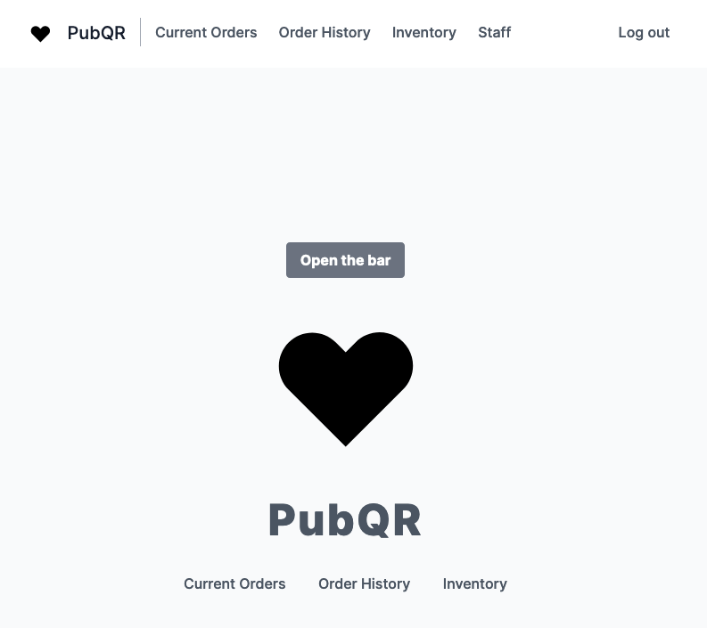

# PubQR

This is a very basic 'shop' to allow people to order items and have them processed by staff.  It came from an idea
to help a local brewery open a beer garden during the current 2020 lockdown so customers could safely order items
and pay for them with a minimum of set up and no need for online payment processing.



## Features

* Add & remove items available to buy - with a quick toggle for if they are currently available
* Download QR codes that link to each item which can be printed onto a menu - then customers can just scan them on their phones and be taken straight to the right page
* Customers can enter the amount of an item they want, a contact name or mobile number and have to tick a box to say they agree to pay
* Show current orders, mark them as completed or cancelled
* Toggle the shop as being open or closed
* See the history of all the orders
* Add and remove members of staff with their own logins
* Download a backup of the site

## Running it

To get a quick demo - the easiest way by far is to install [Docker](https://docs.docker.com/engine/install/) and then run :
```
IMAGE_NAME=pubqr:1.0
docker build -t ${IMAGE_NAME} .
PUBQR_DEMO=1 docker-compose up
```
You should then be able to access the app on http://localhost:3000 as 'admin@example.com' / 'password'.

To run it in production you can use the same compose technique (without the PUBQR_DEMO being set) or ideally use `docker stack deploy -c docker-compose.yml pubqr` instead of the `docker-compose up`.  To create an initial user you can set three environment
variables :
```
PUBQR_ADMIN_NAME=Jenny
PUBQR_ADMIN_EMAIL=jenny@example.com
PUBQR_ADMIN_PASSWORD=myamazingpassword
```
It will then create that user and make them an admin when starting up the application via `docker-compose` or `docker stack deploy`.
